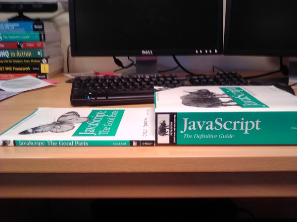

## Purescript - JS you can *reason* about
  Paul Victor Raj
  @JUSPAY

## Guess what is the output?
###

  ```javascript
  parseInt("10")
  ```
  ???

###
  ```javascript
  ["10", "10", "10", "10"].map(parseInt)
  ```
  ???

###

  In summary...

  

## About Purescript
  * A pure functional (Haskell inspired) language
    + Written in Haskell
    + Non - lazy evaluation (like JS)

  * Compiles to JS <!-- (and optionally to other backends) -->

  * Easy javascript FFI

  <!--* Supports -->
    <!--+ higher kinded types-->
    <!--+ poly kinds-->
    <!--+ row polymorphism -->
    <!--+ generic programming -->

## Comparison with other *compile to JS* languages

### Clojurescript vs Purescript
  * Purescript is Static
    + Types can actually avoid a whole class of bugs
  * Purescript is pure
    + No side effects without making them explicit

### Typescript vs Purescript

#### Can be more verbose than JS

  ```javascript
  let apolloContext;
  export function getApolloContext() {
    if (!apolloContext) {
      apolloContext = React.createContext({});
    }
    return apolloContext;
  }
  export function resetApolloContext() {
    apolloContext = React.createContext({});
  }
  ```

  ```typescript
  export interface ApolloContextValue {
    client?: ApolloClient<object>;
    renderPromises?: Record<any, any>;
  }
  let apolloContext: React.Context<ApolloContextValue>;
  export function getApolloContext() {
    if (!apolloContext) {
      apolloContext = React.createContext<ApolloContextValue>({});
    }
    return apolloContext;
  }
  export function resetApolloContext() {
    apolloContext = React.createContext<ApolloContextValue>({});
  }
  ```

####

  > The only thing worse than being blind is having sight but no vision.  
  >  - Helen Keller

#### With Typescript
  * Trust the dev to write proper types
  * Immutability only by choice
  * `any` can be a problem
    + `unknown` still doesn't cut it right
  * Is a superset of Javascript
  * No protection against side effects  

####  Purescript vs Typescript

  * Separation of `effect` full code from others
    ```haskell
      add :: Int -> Int -> Int
      add x y = x + y
    ```

    ```typescript
      function add(a: number, b: number):number {
        return a + b;
      }
    ```

#### A better add

  ```typescript
  function add(a: number, b: number):number {
    var resultFromCache = 
      addCache.lookup(keyFrom(a,b));
    if (resultFromCache == null){
      var result = a + b;
      // some code to insert into the addCache
      return result;
    } else {
      return resultFromCache;
    }
  }
  ```

#### Same code in Purescript

  ```haskell
  add :: Int -> Int -> Effect Int
  add x y = do
    maybeResult <-
      lookup addCache $
        keyFrom x y
    case maybeResult of
      Just r -> pure r
      Nothing -> do
        result <- pure $ x + y
        insert addCache (keyFor x y) result
        pure result
  ```

#### Or even better !!

  ```haskell
  -- type State s a = s -> (a, s)
  add :: Int -> Int -> State CachedResults Int
  add x y = do
    addCache <- get
    maybeResult <-
      lookup addCache $
        keyFrom x y
    case maybeResult of
      Just r -> pure r
      Nothing -> do
        result <- pure $ x + y
        put $
          insert addCache (keyFor x y) result
        pure result
  ```

#### More brownie points
  * More concise syntax
  * Compiler doesn't let you push incomplete functions through
    + Exhaustive Pattern matching
  * Type hole drived development
  * Complemented by the stricter type inference mechanism

## Why you should consider strong types

###

  > A good friend will always stab you in the front  
  >  - Oscar Wilde

###

  * Change a huge class of runtime bugs into compile time errors
    ```haskell
      employee = { name: "Paul", company: "Juspay" }
      log(toUpper(employee.email)) -- A compile error
    ```

  * Better debugging  
     + Find bugs as you type

  * Better development cycles  
     + Let the compiler guide you while writing code

#### Purescript @ Juspay
  * Looking at the type signature of a function tells a lot about it
  * You can't really mess up a pure function
    + Write tests for your pure code
    + Review your impure code
    + Keep impurities to a minimum and at the fringes
  * Write production-ready code
  * ART 
    + Automatic Regression Testing

## Overview of types in Purescript
  Types are _disjoint_ sets of values  
  No _subtyping_ in the traditional sense (except with row polymorphism)

### Sum types
  - Used to denote alternatives
  - Correspond to enums in most programming languages

  <!--```haskell-->
  <!--data Either a b -- Either is the Type Constructor-->
    <!--= Left a-->
    <!--| Right b -- Left and Right are Data Constructors-->
  <!--```-->
  <!--```haskell-->
  <!--Left :: a -> Either a b-->
  <!--```-->

  ```haskell
  data HTTPMethod
    = GET
    | HEAD
    | POST
    | PATCH
    | DELETE
    | Other String
  ```

### Product types
  - Used to denote combination of values
  - Correspond to structs, objects in most programming languages

  <!--```haskell-->
  <!--data Tuple a b -->
    <!--= Tuple a b-->
  <!--```-->

  ```haskell
  data Customer
    = Customer 
      String -- Name
      Int -- Age
  ```
  ```haskell
  data Customer 
    = Customer 
    { name :: String
    , age :: Int }
  ```

### Function types

  * Think as a tabulation of inputs to outputs
  * Impure functions are just dangling function calls (thunks)

### Functions in detail
  * All functions are curried.
  * 1 argument -> 1 argument  
    ```haskell
    add :: Int -> (Int -> Int)
    add x y = x + y -- or
    add x = \y -> x + y -- or
    add = \x -> \y -> x + y
    ```
  * Partial Application for free
    ```haskell
    increment :: Int -> Int
    increment = add 1
    ```
    ```haskell
    sum :: [ Int ] -> Int
    sum = foldl (+) 0
    ```

### Pattern matching
  ```haskell
  data Direction = N | S | E | W
  data Coordinates = Coordinates { x :: Int, y :: Int }

  -- Currying
  move :: Direction -> Coordinates -> Coordinates
  move N (Coordinates { x, y }) = Coordinates { x, y: y + 1 }
  move S (Coordinates { x, y }) = Coordinates { x, y: y - 1 }
  move E (Coordinates { x, y }) = Coordinates { x: x + 1, y }
  move W (Coordinates { x, y }) = Coordinates { x: x - 1, y }
  ```

  * Matching patterns has to be complete

### Partial Application
  ```haskell
  moveNorth :: Coordinates -> Coordinates
  moveNorth = move N
  ```

### Composition
  * _>>>_ and _<<<_
  ```haskell
  (>>>) f g = \a -> g (f a)
  (<<<) f g = \a -> f (g a)
  ```
  ```haskell
  moveNE :: Coordinates -> Coordinates
  moveNE = move N >>> move E
  ```

## Scrap your _null_ checks and NPE's

  >  I call it my billion-dollar mistake  
  >  - Tony Hoare

  ```haskell
  data Maybe a = Nothing | Just a
  ```

  ```haskell
  divide :: Int -> Int -> Maybe Int
  divide 0 0 = Nothing
  divide x y = Just (x / y)
  ```
  `Just` is a proof that there is indeed a value  
  and its safe to access the value without an exception

## Pure functions 
  * `a -> b`
  * but what if we want more ?

### Effects
  * `List a` - Returns multiple `a`'s
  * `Maybe a` - May not return an `a`
  * `Tuple a b` - Return an `a` with `a` payload
  * `Reader r a` - Use a `r` to produce an `a`
  * `Writer w a` - Produce an `a`, but log a `w`
  * `State s a` - Produce an `a`, but use or update some state `s`
  * `Parser a` - Consume some input and return an `a`
  * `Effect a` - Nondeterministically get an `a`
  * `Aff a` - An `Effect` ful callback which can consume an `a`

### Monads
  * Computation builders
  * Almost all programming patterns can be expressed in monads

### `do` blocks  
  + Convenient syntactic sugar 
  ```haskell
  factors x = do
  y <- 2 .. (ceil $ M.sqrt(toNumber x))
  z <- 2 ..  (ceil $ M.sqrt(toNumber x))
  if y * z == x
    then pure y
    else mempty
  ```

### `do` 'em all
  ```haskell
  -- Maybe
  getLogTime :: String -> Maybe LocalTime
  getLogTime logLine = do
    obj <- Aeson.parse logLine
    metaData <- Map.lookup obj "meta_data"
    timeStampStr <- Map.lookup metaData "log_time"
    parseTime "%d-%m-%Y %HH:%MM:%SS" timeStampStr
  ```

### Bye bye callbacks  
  ```haskell
  -- Aff
  getLastTxn :: String -> Aff (Maybe Txn)
  getLastTxn customerId = do
    accounts <- getAccounts customerId
    if null accounts 
    then pure Nothing
    else do
      txns <- for accounts getTxns
      pure (maximumBy (compare `on` txnDate) txns)
  ```

### An entire app
  * No details
  ```haskell
  billPayFlow :: Flow BillPayFailure StatusScreenAction
  billPayFlow = do
    _            <- UI.splashScreen
    operators    <- Remote.fetchOperators
    operator     <- UI.chooseOperator operators
    mobileNumber <- UI.askMobileNumber
    amount       <- UI.askAmount
    result       <- Remote.payBill mobileNumber amount operator
    UI.billPayStatus mobileNumber amount result
  ```

## Interacting with JS
### Importing JS funcions
  *  Curried
  ```javascript
  exports.add = function(i) {
    return function(j) {
        return i + j; 
    }; 
  }
  ```
  ```haskell
  foreign import add :: Int -> Int -> Int
  ```
  * Uncurried
  ```javascript
  exports.add = function(i, j) { return i + j; }
  ```
  ```haskell
  foreign import add :: Fn2 Int Int Int
  ```

### Importing JS types
#### Primitives
  ```javascript
  exports.foo = "bar";
  exports.i = 5;
  exports.hasProp = true;
  exports.arr = [1,2,3]; 
  // Cannot import an array with multiple types
  exports.employee = { name: "Paul", company: "Juspay" };
  ```
  ```haskell
  foreign import foo :: String
  foreign import i :: Int
  foreign import hasProp :: Boolean
  foreign import arr :: Array Int
  foreign import employee :: { name :: String, company :: String }
  ```

#### When JS types are unknown

  ```javascript
  exports.foo = "bar";
  ```
  ```haskell
  foreign import foo :: Foreign
  -- readString 
  --   :: Foreign 
  --   -> F String -- Except MultipleErrors String
  exclaimFoo :: F String
  exclaimFoo = (\s -> s <> "!!") <$> readString foo
  ```

### Exporting purescript funcions
  ```haskell
    add :: Fn2 Int Int Int
    add = mkFn2 add'

    add' :: Int -> Int -> Int
    add' i j = i + j
  ```
  ```js
  // In the generated JS code.
  add(4,2)
  ```

### Effects
  ```javascript
  exports.logFormatted = function(tag){
    return function(message){
      return function(){
        var dateStr = (new Date).toISOString();
        console.log("[" + tag + "] " + dateStr + message);
      }
    }
  }
  ```
  ```haskell
  foreign import logFormatted :: String -> String -> Effect Unit
  ```

## Purescript web frameworks
  * Elm like 
    * `purescript-pux`
    * `purescript-thermite`
  * Component based
    * `purescript-halogen`
  * `purescript-react`
  * FRP based
    * `purescript-flare`
    * `purescript-specular`
  * `purescript-presto`
  * `purescript-virtual-dom`

## At Juspay
  * Heavily used
    + both on the backend and mobile UI
    + frontend count > 100000 LOC
    + used for both for markup and business logic
  * English like code 
    + `DSL`s using `Free Monad`s
